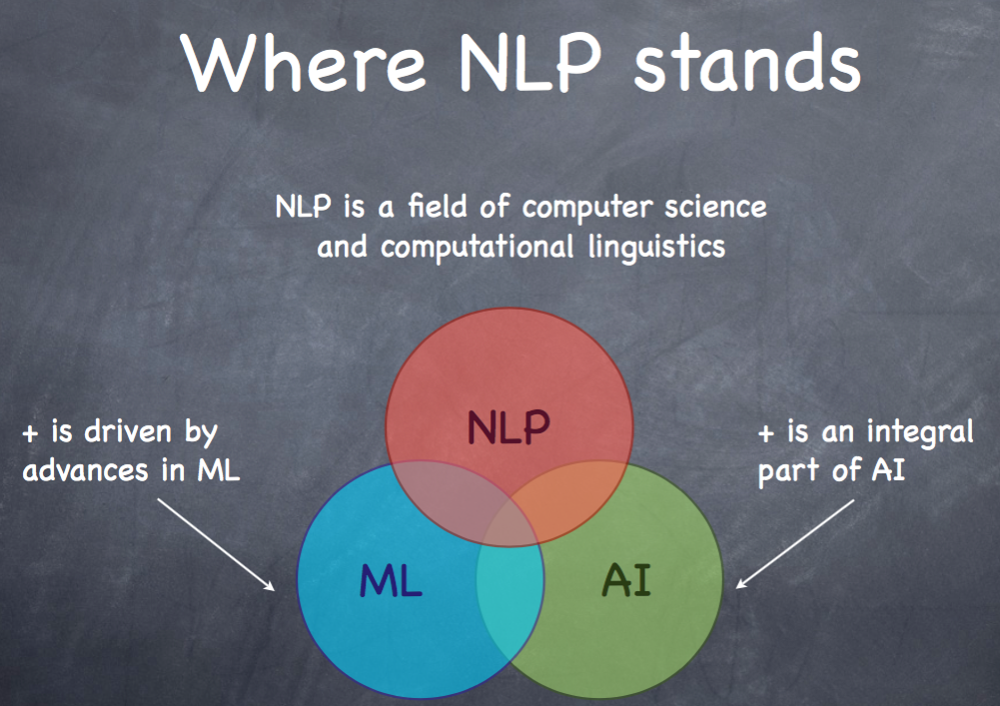
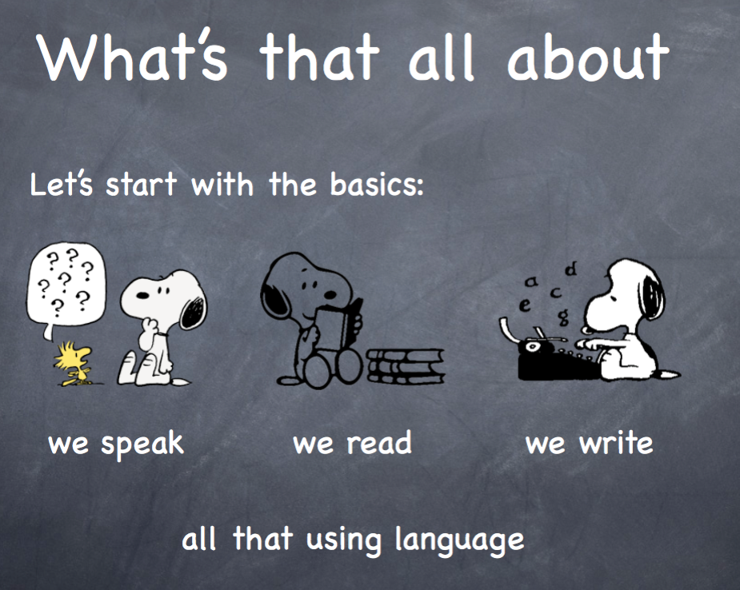
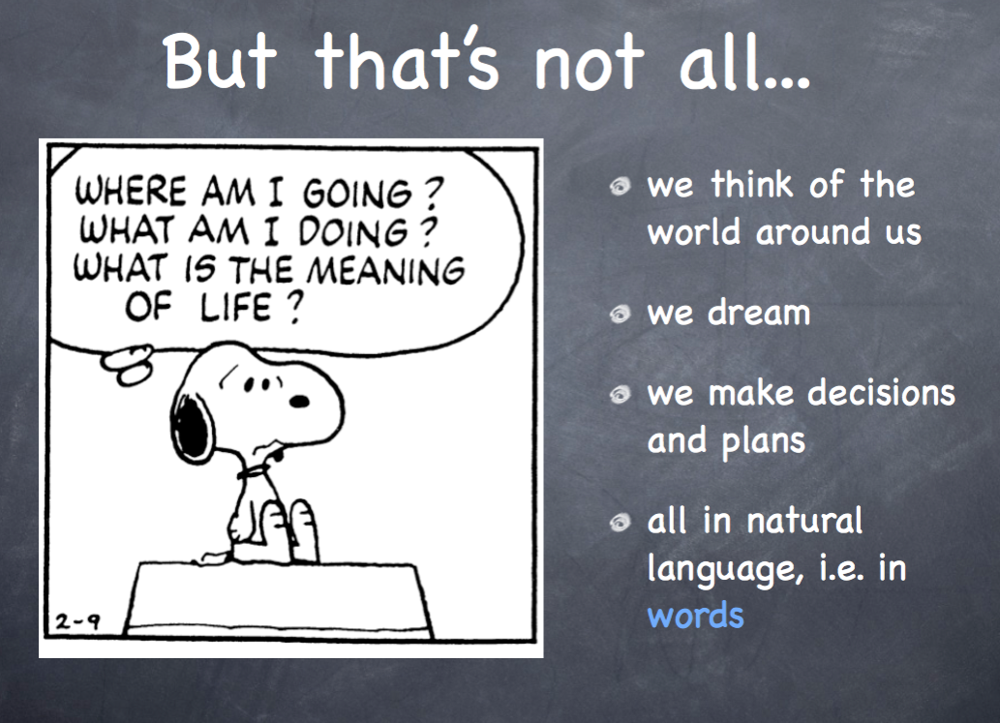
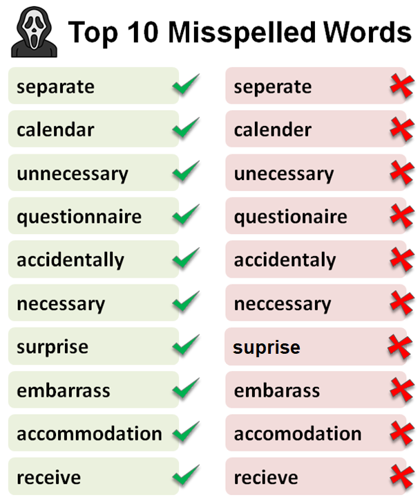
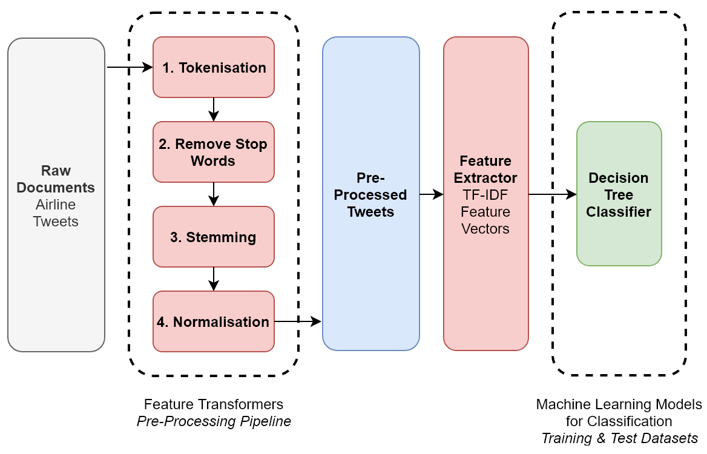

# Lab 1 - Introduction to Natural Language Processing

This file is the complete lab as a readable document: the explanations, the code, and the printed outputs, in the same order as the notebook [Lab1_Introduction_to_NLP.ipynb](Lab1_Introduction_to_NLP.ipynb).
Open the notebook to run the cells yourself.

---

# Introduction to Natural Language processing

**Natural language processing (NLP):** Subfield of linguistics, computer science, and information engineering concerned with the interactions between computers and human (natural) languages, in particular how to program computers to process and analyze large amounts of natural language data.



## What is it all about?





## What are the raw materials for NLP revolution?
**1. Data:** There is a huge amount of human knowledge that has been digitized.

**2. Compute:** Our personal computers are very powerful, and it has never been easier to rent more compute power.

**3. Algorithms:** We use a combination of Computer Science, Machine Learning, Deep Learning, and linguist techniques.

## Why NLP is hard?
It’s the nature of the human language that makes NLP difficult.

### Some examples:

**1. Ambiguity:** One word/sentence can have different meanings.


**2. Spelling Errors:** There are some words that are usually misspelled by people.



**3. Phonetics and Phonology**: Different words that have the same pronunciation.

- there / their
- plane / plain
- ice cream / I scream

**4. Order of Context:** "Dog bites man" and "Man bites dog" have vastly different meanings

### In ML terms, why is NLP hard?

**1. Input:** Large, discrete, open-ended input state spaces

**2. Output:** Variable length output spaces

**3. Algorithms:** Recycled from other fields

## Top Used Text File Types

- CSV
- Text Files
- JSON
- SQL
- HTML
- PDF
- DOCX

## NLP Libraries

There are many popular NLP libraries that we will cover in the next labs. In this lab, we will get introduced to NLTK.

### NLTK
Natural Language Toolkit (nltk) is a Python package for NLP
https://www.nltk.org/

#### What are Corpus / Corpora?

a collection of written texts, especially the entire works of a particular author or a body of writing on a particular subject.

```python
!pip install nltk
```

```python
import nltk
```

### Arabic Libraries (Extra)

Camel-Tools: https://camel-tools.readthedocs.io/en/latest/

PyArabic: https://pyarabic.readthedocs.io/ar/latest/

Farasa: https://farasa.qcri.org/

## NLP Applications

**1. Information Extraction**

The automated retrieval of specific information related to a selected topic from a body or bodies of text.

**2. Machine Translation**

The process of using artificial intelligence to automatically translate text from one language to another without human involvement.

**3. Sentiment Analysis**

Identifying sentiments and opinions stated in a text.

## Example of an NLP Pipeline



#### 1. Text Acquisition:
Obtain the text data from a source, such as a file, a web page, or a database.

#### 2. Text Preprocessing:
- **Tokenization:** Split the text into individual words or tokens.
- **Lowercasing:** Convert all tokens to lowercase to ensure uniformity.
- **Removing Punctuation:** Strip away punctuation marks from tokens.
- **Stopword Removal:** Eliminate common words (e.g., "and," "the," "is") that may not carry significant meaning.
- **Stemming:** Removes prefixes/suffixes to get a root form. (Running -> run)
- **Lemmatization:** Converts word to base/dictionary form (lemma). (better -> good).

#### 3. Feature Extraction:
- **Bag-of-Words (BoW):** Create a vector representation of the text using the frequency of each token in the document.
- **TF-IDF (Term Frequency-Inverse Document Frequency):** Assign weights to tokens based on their importance in the document relative to the entire corpus.

#### 4. Model Building:
Choose a machine learning model for sentiment analysis, such as a Naive Bayes classifier, Support Vector Machine (SVM), or a neural network.

---

### Task#1:

Students should work in groups and search online for one of the different types of datasets.
- CSV
- Text Files
- JSON
- SQL
- HTML
- PDF
- DOCX

### Task#2:

Download and open the dataset.

```python
conda install kagglehub
```

Output:

```text
Jupyter detected...
Note: you may need to restart the kernel to use updated packages.

==> WARNING: A newer version of conda exists. <==
    current version: 25.5.1
    latest version: 25.7.0

Please update conda by running

    $ conda update -n base -c defaults conda

3 channel Terms of Service accepted
Channels:
 - defaults
Platform: win-64
Solving environment: done

# All requested packages already installed.
```

```python
import kagglehub

# IMDB Dataset of 50K Movie Reviews
path = kagglehub.dataset_download("lakshmi25npathi/imdb-dataset-of-50k-movie-reviews")

print("Path to dataset files:", path)
```

Output:

```text
Path to dataset files: C:\Users\sumay\.cache\kagglehub\datasets\lakshmi25npathi\imdb-dataset-of-50k-movie-reviews\versions\1
```

```python
import pandas as pd

# load the CSV file in a dataframe
df = pd.read_csv("IMDB Dataset.csv")

# Show the first few rows
df.head()
```

Output:

```text
review sentiment
0  One of the other reviewers has mentioned that ...  positive
1  A wonderful little production. <br /><br />The...  positive
2  I thought this was a wonderful way to spend ti...  positive
3  Basically there's a family where a little boy ...  negative
4  Petter Mattei's "Love in the Time of Money" is...  positive
```

```python
df.describe()
```

Output:

```text
review sentiment
count                                               50000     50000
unique                                              49582         2
top     Loved today's show!!! It was a variety and not...  positive
freq                                                    5     25000
```

```python
df.info()
```

Output:

```text
<class 'pandas.core.frame.DataFrame'>
RangeIndex: 50000 entries, 0 to 49999
Data columns (total 2 columns):
 #   Column     Non-Null Count  Dtype 
---  ------     --------------  ----- 
 0   review     50000 non-null  object
 1   sentiment  50000 non-null  object
dtypes: object(2)
memory usage: 781.4+ KB
```

```python
# Check class distribution
print(df['sentiment'].value_counts())
```

Output:

```text
sentiment
positive    25000
negative    25000
Name: count, dtype: int64
```

```python
# your solution here
```
