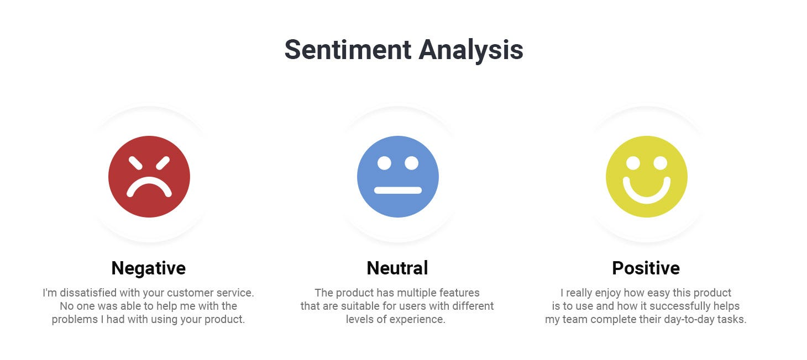

# Lab 4 - Classification and Evaluation

This file is the complete lab as a readable document: the explanations, the code, and the printed outputs, in the same order as the notebook [Lab4_Classification_and_Evaluation.ipynb](Lab4_Classification_and_Evaluation.ipynb).
The same code is also available as small runnable files in the [code/](code/) folder.

---

# Classification and Evaluation in NLP

**Text classification** is a common Natural Language Processing (NLP) task where a model assigns a predefined category or label to a piece of text.

Examples include:
- Spam detection
- Sentiment analysis
- News categorization

In this lab, we will learn how to build and evaluate a text classification model.

## Case Study: Sentiment Analysis

Sentiment analysis, also known as opinion mining, its goal is to understand the information present in the text and categorize it as positive, negative, or neutral.



# Disneyland Reviews Dataset
In this lab we'll look into Disneyland Reviews dataset.
*Link: https://www.kaggle.com/datasets/arushchillar/disneyland-reviews*

The dataset includes 42,000 reviews of 3 Disneyland branches - Paris, California and Hong Kong, posted by visitors on Trip Advisor.

Column Description:

- Review_ID: unique id given to each review
- Rating: ranging from 1 (unsatisfied) to 5 (satisfied)
- Year_Month: when the reviewer visited the theme park
- Reviewer_Location: country of origin of visitor
- Review_Text: comments made by visitor
- Disneyland_Branch: location of Disneyland Park

```python
# Load the dataset
import pandas as pd

data = pd.read_csv('/content/DisneylandReviews.csv', encoding='latin-1')
data
```

Output:

```text
Review_ID  Rating Year_Month     Reviewer_Location  \
0      670772142       4     2019-4             Australia   
1      670682799       4     2019-5           Philippines   
2      670623270       4     2019-4  United Arab Emirates   
3      670607911       4     2019-4             Australia   
4      670607296       4     2019-4        United Kingdom   
...          ...     ...        ...                   ...   
42651    1765031       5    missing        United Kingdom   
42652    1659553       5    missing                Canada   
42653    1645894       5    missing          South Africa   
42654    1618637       4    missing         United States   
42655    1536786       4    missing        United Kingdom   

                                             Review_Text               Branch  
0      If you've ever been to Disneyland anywhere you...  Disneyland_HongKong  
1      Its been a while since d last time we visit HK...  Disneyland_HongKong  
2      Thanks God it wasn   t too hot or too humid wh...  Disneyland_HongKong  
3      HK Disneyland is a great compact park. Unfortu...  Disneyland_HongKong  
4      the location is not in the city, took around 1...  Disneyland_HongKong  
...                                                  ...                  ...  
42651  i went to disneyland paris in july 03 and thou...     Disneyland_Paris  
42652  2 adults and 1 child of 11 visited Disneyland ...     Disneyland_Paris  
42653  My eleven year old daughter and myself went to...     Disneyland_Paris  
42654  This hotel, part of the Disneyland Paris compl...     Disneyland_Paris  
42655  I went to the Disneyparis resort, in 1996, wit...     Disneyland_Paris  

[42656 rows x 6 columns]
```

```python
#Check for missing values
data.isna().sum()
```

Output:

```text
Review_ID            0
Rating               0
Year_Month           0
Reviewer_Location    0
Review_Text          0
Branch               0
dtype: int64
```

```python
# Drop rows with missing values in the relevant columns
data = data.dropna(subset=['Review_Text', 'Rating'])
```

```python
# Map star ratings to sentiments
data['Sentiment'] = data['Rating'].apply(lambda rating: 'positive' if rating > 3 else ('negative' if rating < 3 else 'neutral'))
data.head()
```

Output:

```text
Review_ID  Rating Year_Month     Reviewer_Location  \
0  670772142       4     2019-4             Australia   
1  670682799       4     2019-5           Philippines   
2  670623270       4     2019-4  United Arab Emirates   
3  670607911       4     2019-4             Australia   
4  670607296       4     2019-4        United Kingdom   

                                         Review_Text               Branch  \
0  If you've ever been to Disneyland anywhere you...  Disneyland_HongKong   
1  Its been a while since d last time we visit HK...  Disneyland_HongKong   
2  Thanks God it wasn   t too hot or too humid wh...  Disneyland_HongKong   
3  HK Disneyland is a great compact park. Unfortu...  Disneyland_HongKong   
4  the location is not in the city, took around 1...  Disneyland_HongKong   

  Sentiment  
0  positive  
1  positive  
2  positive  
3  positive  
4  positive
```

```python
# Import necessary libraries
import re
import nltk

def preprocess_text(text):

    # 1. Convert text to lowercase
    text = text.lower()

    # 2. Remove punctuation and special characters
    text = re.sub(r'[^a-z\s]', '', text)

    # 3. Tokenize the text
    words = text.split()

    return ' '.join(words)

# Apply preprocessing to the review text
data['Review_Text'] = data['Review_Text'].apply(preprocess_text)

# Display cleaned reviews
data[['Review_Text', 'Sentiment']].head()
```

Output:

```text
Review_Text Sentiment
0  if youve ever been to disneyland anywhere youl...  positive
1  its been a while since d last time we visit hk...  positive
2  thanks god it wasn t too hot or too humid when...  positive
3  hk disneyland is a great compact park unfortun...  positive
4  the location is not in the city took around ho...  positive
```

```python
# Import necessary libraries
from sklearn.model_selection import train_test_split
from sklearn.feature_extraction.text import TfidfVectorizer

# Split the dataset into training and testing sets
train_data, test_data, train_labels, test_labels = train_test_split(data['Review_Text'], data['Sentiment'], test_size=0.2, random_state=42)

# TF-IDF Vectorization
tfidf_vectorizer = TfidfVectorizer(max_features=1000)  # You can adjust max_features based on your dataset size - limit vocabulary to the 1000 most informative tokens
train_vectors = tfidf_vectorizer.fit_transform(train_data)
test_vectors = tfidf_vectorizer.transform(test_data)
```

```python
print(f"train_data size: {train_data.shape}")
print(f"test_data size: {test_data.shape}")
```

Output:

```text
train_data size: (34124,)
test_data size: (8532,)
```

```python
from sklearn.svm import SVC
from sklearn.metrics import accuracy_score, classification_report

# Train the Support Vector Machine (SVM) classifier
svm_classifier = SVC(kernel='linear')
svm_classifier.fit(train_vectors, train_labels)

# Predictions on the test set
predictions = svm_classifier.predict(test_vectors)

# Evaluate the model
accuracy = accuracy_score(test_labels, predictions)
print(f"Accuracy: {accuracy:.2f}")

# Display classification report
print("Classification Report:")
print(classification_report(test_labels, predictions))
```

Output:

```text
Accuracy: 0.84
Classification Report:
              precision    recall  f1-score   support

    negative       0.64      0.54      0.58       720
     neutral       0.48      0.18      0.26      1035
    positive       0.88      0.98      0.92      6777

    accuracy                           0.84      8532
   macro avg       0.66      0.56      0.59      8532
weighted avg       0.81      0.84      0.81      8532
```

# Use Case:  Amazon reviews of unlocked phone analysis

The objective of this use case is to conduct sentiment analysis on Amazon reviews of unlocked phones, categorizing reviews into three classes: positive, negative, and neutral. The goal is to gain a comprehensive understanding of customer opinions and sentiments regarding various unlocked phone models.

- Dataset link: https://www.kaggle.com/datasets/PromptCloudHQ/amazon-reviews-unlocked-mobile-phones

Task1: Load the data and do 5 different preprocessing steps on it

Task2: Use a proper train and test split

Task3: Do Feature Extraction Using TF-IDF

Task4: Train a Naive Bayes Classifier

Task5: Evaluate the model on the Test Set

Task6: Print the Confusion Matrix

```python
# your solution here
```
