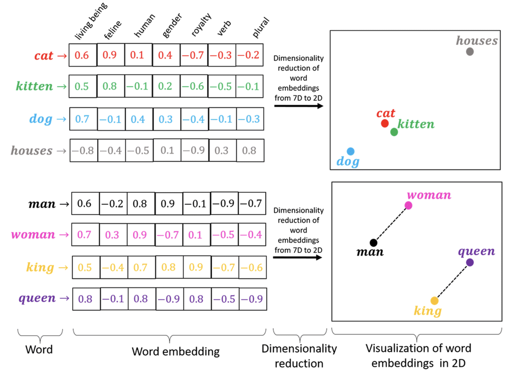
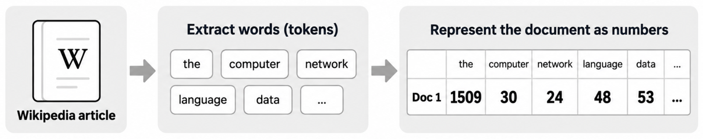
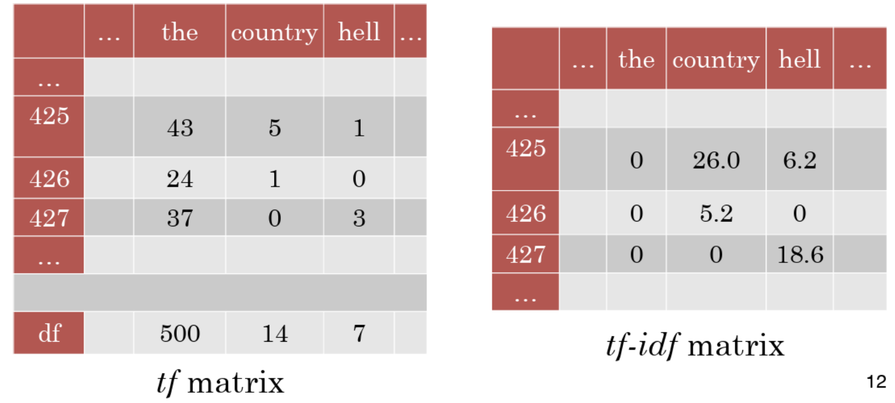
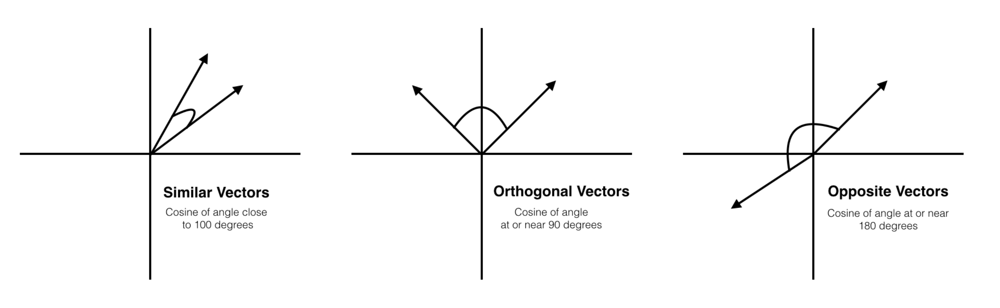
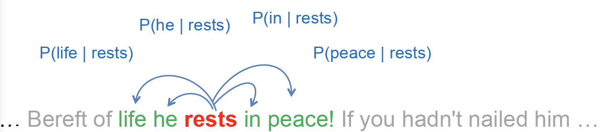

# Lab 5 - Text Representation

This file is the complete lab as a readable document: the explanations, the code, and the printed outputs, in the same order as the notebook [Lab5_Text_Representation.ipynb](Lab5_Text_Representation.ipynb).
The same code is also available as small runnable files in the [code/](code/) folder.

---

# Text Representation

Text representation in NLP means converting text into a numerical form that a machine learning model can understand and process.

## What is Embedding?

Embeddings in NLP is a technique where individual words are represented as real-valued vectors and captures inter-word semantics.

In this notebook, We going to intreduce 2 techniques for embedding. These techniques will be used for a machine learning models such as SVM, Random forest, ... ect.



# 1- TF-IDF



TF-IDF stands for term frequency-inverse document frequency. It is a measure that discounts common words. Used in the fields of information retrieval (IR) and machine learning, that can quantify the importance of words in a document amongst a collection of documents (also known as a corpus).

### Components of TF-IDF

1. **TF (Term Frequency):**
   Measures how frequently a term appears in a document.

$$ \text{TF}(t, d) = \frac{\text{Number of times term } t \text{ appears in document } d}{\text{Total number of terms in document } d} $$

2. **IDF (Inverse Document Frequency):**
   Measures how important a term is across all documents. Words that appear in many documents get lower scores.

$$    \text{IDF}(t) = \log \left(\frac{\text{Number of all documents N}}{\text{Number of documents containing the term } t}\right) $$



```python
from sklearn.feature_extraction.text import TfidfVectorizer
```

```python
doc_1 = "Data is the oil of the digital economy"
doc_2 = "Data is a new oil"

data = [doc_1, doc_2]
```

```python
tfidf = TfidfVectorizer()
result = tfidf.fit_transform(data) # returns sparce matrix
```

```python
df = pd.DataFrame(result.toarray(), columns=tfidf.get_feature_names_out())
df
```

Output:

```text
data  digital  economy        is       new       of       oil      the
0  0.243777  0.34262  0.34262  0.243777  0.000000  0.34262  0.243777  0.68524
1  0.448321  0.00000  0.00000  0.448321  0.630099  0.00000  0.448321  0.00000
```

# Cosine similarity

In NLP, Cosine similarity is a metric used to measure how similar the documents are.

$$ \text{cosine similarity} = \frac{A \cdot B}{\|A\| \times \|B\|} $$

Where:
$ A \cdot B $  = dot product of vectors A and B
$ \|A\| $ = magnitude (length) of vector A
$ \|B\| $ =  magnitude (length) of vector B

#### Intuition

- If vectors point in the **same direction**, cosine similarity = **1** (maximum similarity).
- If vectors are **orthogonal (90° apart)**, cosine similarity = **0** (no similarity).



```python
import pandas as pd
from sklearn.feature_extraction.text import TfidfVectorizer
from sklearn.metrics.pairwise import cosine_similarity
```

```python
# Sample text data (replace with your own documents)

doc_1 = "Data is the oil of the digital economy"
doc_2 = "Data is a new oil"

data = [doc_1, doc_2]
```

```python
tfidf_vectorizer = TfidfVectorizer() # Create a CountVectorizer instance
vector_matrix = tfidf_vectorizer.fit_transform(data) # Fit and transform the documents into numerical vectors
```

```python
# Calculate the cosine similarity between the documents
cosine_similarity_matrix = cosine_similarity(vector_matrix)

df_cosine = pd.DataFrame(data=cosine_similarity_matrix, index=data, columns=data)

df_cosine
```

Output:

```text
Data is the oil of the digital economy  \
Data is the oil of the digital economy                                1.000000   
Data is a new oil                                                     0.327871   

                                        Data is a new oil  
Data is the oil of the digital economy           0.327871  
Data is a new oil                                1.000000
```

# 2- What is Word2vec?

Word2Vec consists of models for generating word embedding. These models are two-layer neural networks having one input layer, one hidden layer, and one output layer.

Word2Vec utilizes two architectures :
1. CBOW (Continuous Bag of Words)
2. **Skip Gram**



Run this command in terminal to install
> pip install gensim

We will use fake and real news dataset to do our expirament. You can find the dataset here: https://www.kaggle.com/datasets/clmentbisaillon/fake-and-real-news-dataset?select=True.csv

```python
import pandas as pd
import nltk
import numpy as np
import gensim

from nltk.tokenize import word_tokenize
```

```python
df = pd.read_csv('/content/True.csv', engine='python', on_bad_lines='skip') #fake-and-real-news-dataset-true.csv
df.head()
```

Output:

```text
title  \
0  As U.S. budget fight looms, Republicans flip t...   
1  U.S. military to accept transgender recruits o...   
2  Senior U.S. Republican senator: 'Let Mr. Muell...   
3  FBI Russia probe helped by Australian diplomat...   
4  Trump wants Postal Service to charge 'much mor...   

                                                text       subject  \
0  WASHINGTON (Reuters) - The head of a conservat...  politicsNews   
1  WASHINGTON (Reuters) - Transgender people will...  politicsNews   
2  WASHINGTON (Reuters) - The special counsel inv...  politicsNews   
3  WASHINGTON (Reuters) - Trump campaign adviser ...  politicsNews   
4  SEATTLE/WASHINGTON (Reuters) - President Donal...  politicsNews   

                 date  
0  December 31, 2017   
1  December 29, 2017   
2  December 31, 2017   
3  December 30, 2017   
4  December 29, 2017
```

```python
tokens = []

for i in df['text']:
    token = word_tokenize(i)
    tokens.append(token)
```

```python
w2v = gensim.models.Word2Vec(tokens, min_count=1, vector_size=100, window=5, sg=1)
```

```python
print("Cosine similarity between 'provide' and 'program' - Skip Gram : ",w2v.wv.similarity('provide', 'program'))
```

Output:

```text
Cosine similarity between 'provide' and 'program' - Skip Gram :  0.41992348
```

```python
print("words that similar to 'program' - Skip Gram : ",w2v.wv.most_similar('program'))
```

Output:

```text
words that similar to 'program' - Skip Gram :  [('programs', 0.7426663041114807), ('programme', 0.687917172908783), ('guest-worker', 0.6685435771942139), ('EB-5', 0.66179358959198), ('seniors', 0.6605323553085327), ('arsenal', 0.659981906414032), ('expanding', 0.6542479395866394), ('abolishing', 0.6510066390037537), ('plan', 0.6469865441322327), ('marketplaces', 0.6462255120277405)]
```

# Tasks

### Task 1: Cosine Similarity
Use the Cosine Similarity method to determine how similar the following sentences are.

'This is the first document.',
'This document is the second document.',
'And this is the third one.',
'Is this the first document?'

```python
# your solution here
```

### Task 2: TF-IDF
Use tf-idf method on the sentences below to determine the important words.

'data science is one of the most important fields of science',
'this is one of the best data science courses',
'data scientists analyze data'

```python
# your solution here
```

## Word2vec

### Task 3:

Download the Simpsons dataset **(simpsons_script_lines.csv)** and apply the preprocessing procedure.
Use the **'spoken_words'** column.
```
def clean_text(text):
    text = text.lower()
    text = re.sub(r"[0-9]", '', text)
    text = re.sub(r"[)(,”“.’$-]", '', text)
    return text
```
Create a skip gram Word2Vec model as below.
```
Skip_gram_model = gensim.models.Word2Vec(tokens, min_count = 1, vector_size = 100, window = 5, sg = 1)
```

```python
# your solution here
```

### Task 4

Use: wv.most_similar() method to :

1. Find the words similar to “homer”.

2. Find the words similar to “marge”.

3. Find the words similar to “bart”

```python
# your solution here
```

### Task 5

Use the wv.doesnt_match() method to :

1. Find which of 'jimbo', 'milhouse’, and 'kearney’ does not belong to the list.

3. Find the odd one among "nelson", "bart", and "milhouse".

4. Find the odd one among ‘homer', 'patty', and ‘selma'.

*Hint: You need to pass the strings as List*

```python
# your solution here
```
